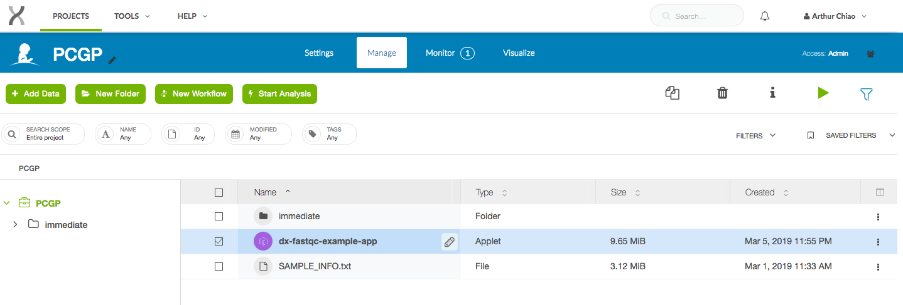
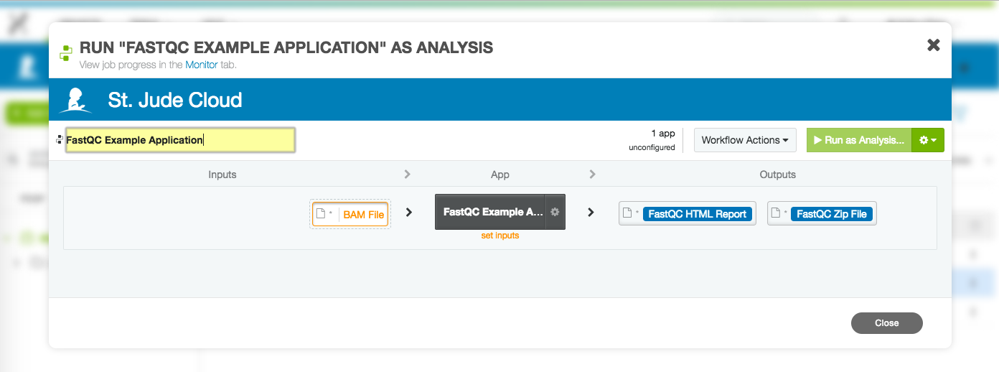
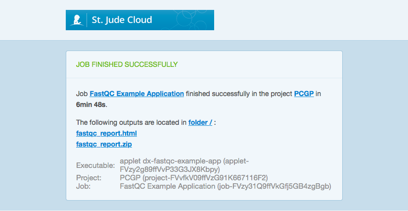
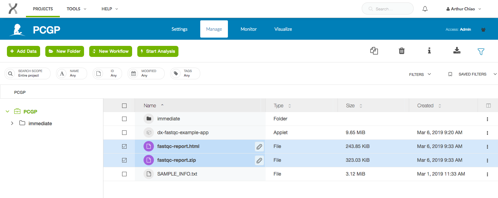

# Creating a Cloud Application

This guide will take you through the process of writing an application for working with and manipulating the St. Jude data you've requested. By creating your own application, you will be able to wrap genomic tools and packages from external sources, as well as any tool or application you might have written yourself.

!!! tip
    The complete contents of this guide is hosted on the [St. Jude App Tutorial](https://github.com/stjudecloud/cloud-app-tutorial) repository on GitHub. Feel free to clone the repository and use it as a reference while following this tutorial or try building the application and running it on your own project.

## Overview

The biggest difference between running an application in the cloud (as opposed to running it in a local environment) is the way we access that data and manipulate it. Writing and running your own cloud application grants numerous benefits. It allows you to submit numerous jobs in parallel, access your data from anywhere with an Internet connection, and utilize resources and compute power at a fraction of the cost (when compared to building your own infrastructure).

Writing your own application will allow you to wrap custom tools to manipulate any data that you have previously requested. When you run your application, the request gets sent to a virtualized Linux container (Ubuntu 14.04 or 16.04) where any dependencies are installed and where your script will be run. Any tools or packages that you include (either through the included package managers, or bundled together in your project) will be available locally on the virtual Linux machine.

However, there are differences in how we manage our data. When a job is submitted, a virtual machine is provisioned specifically for that job request, meaning that it is spun up at-will or when needed. It also implies that once the job has completed, the virtual machine will be reprovisioned or deleted. Any job output or data must be uploaded back to the project space.

In this tutorial, we will be wrapping the [FastQC](https://www.bioinformatics.babraham.ac.uk/projects/fastqc/), a quality control tool for raw sequence data, into our application. This will allow us to run FastQC on any of the St. Jude next generation sequencing data in the cloud. For specific information about how FastQC works, please refer to the [FastQC documentation](https://www.bioinformatics.babraham.ac.uk/projects/fastqc/Help/).


## Data

For this tutorial I have requested the PCGP dataset, and once my access request has been approved, my project directory space will look like the following.


!!!note
    If you do not yet have data in a DNAnexus project, you may request data from St. Jude Cloud by following the directions [here](../../guides/data/data-request.md) or you may upload your own data using the [data transfer app](../../guides/data/data-transfer-app.md). In order to make a data request or upload your own data using the data transfer app, you must first [create a St. Jude Cloud account](../../create-an-account.md).


## Writing the Application

### Requirements

<center>

| Tool       | Download                                                             | Website                                                               | Version  |
| ---------- | -------------------------------------------------------------------- | --------------------------------------------------------------------- | -------- |
| dx-toolkit | [Source](https://documentation.dnanexus.com/downloads)               | [DNAnexus](https://www.dnanexus.com/)                                 | v0.276.0 |
| FastQC     | [Source](https://www.bioinformatics.babraham.ac.uk/projects/fastqc/) | [Babraham Bioinformatics](https://www.bioinformatics.babraham.ac.uk/) | v0.11.8  |

</center>


For this application, we will be using the `dx-app-wizard` command that is included in the `dx-toolkit`. `dx-app-wizard` is an interactive prompt that creates a boilerplate project that will allow you to quickly create an application. For more on `dx-app-wizard`, refer to the DNAnexus wiki article on [Intro to Building Apps](https://documentation.dnanexus.com/developer/apps/intro-to-building-apps). Before continuing, be sure to refer to the [command line interaction page](../../guides/data/command-line.md) for a walkthrough on how to install [dx-toolkit](https://documentation.dnanexus.com/downloads#DNAnexus-Platform-SDK) and how to select your project workspace.

!!! tip
    It is not necessary to use `dx-app-wizard`. All the necessary files and project directory structure can be created manually. However, `dx-app-wizard` provides a quick and easy way to get started. For more information, refer to the [Advanced App Tutorial](https://documentation.dnanexus.com/developer/apps/advanced-app-tutorial).

All DNAnexus project applications will have the following structure:

```
dx-fastqc-example-app/
├── dxapp.json
├── resources/
│   └── usr/
│       └── bin/
└── src/
    └── dx-fastqc-example-app.sh
```

The `dxapp.json` file is a JSON file that contains metadata about the application we are writing that are needed to build and run the app on the DNAnexus Platform. Most notably, you will need to specify all of the inputs your app requires (both input files or any settings you can tune), output files, and other options such as the number of cores and memory required to run the tool. To see the full list of fields, refer to the [DNAnexus wiki](https://documentation.dnanexus.com/developer/apps/app-metadata) guide on the application metadata.

The `dx-fastqc-example-app.sh` file is a bash script is what will be executed when the application is run. Any executable binaries that accompany the application, such as other tools or scripts, are placed in the `resources` folder. From there, we can call the executable from within the app when it is run.

## Creating the Project

Start by running the `dx-app-wizard` command from your terminal.

!!! info
    This helper tool will create a **local** directory on your machine. Any code changes we make will be done *inside* this local project directory created by `dx-app-wizard`. This is because we can write our application locally, [build the application](../../guides/data/creating-a-cloud-app/#building-your-app), and then [run the application](../../guides/data/creating-a-cloud-app/#running-your-app) in the cloud.

    Building the application will compile `dx-fastqc-example-app` and then upload it into the project space on the cloud. When we run an application, it will be submitted as a job to be run in the cloud. With this process, we can write the application locally and run it on our data in the cloud, without ever having to utilize personal bandwidth and compute time.

```bash
$ dx-app-wizard
```

For our inputs, we will enter the following:

```bash
$ App Name: dx-fastqc-example-app
...
$ Title []: FastQC Example Application
...
$ Summary []: Uses FastQC to generate quality control reports on raw sequence data.
...
$ Version [0.0.1]: 0.0.1
...
$ 1st input name (<ENTER> to finish): bam_file
$ Label (optional human-readable name) []: BAM File
...
$ Choose a class (<TAB> twice for choices): file
$ This is an optional parameter [y/n]: n
...
$ 1st output name (<ENTER> to finish): fastqc_html
$ Label (optional human-readable name) []: FastQC HTML Report
$ Choose a class (<TAB> twice for choices): file

$ 2nd output name (<ENTER> to finish): fastqc_zip
$ Label (optional human-readable name) []: FastQC Zip File
$ Choose a class (<TAB> twice for choices): file
...
$ Timeout policy [48h]: 48h
...
$ Programming language: bash
...
$ Will this app need access to the Internet? [y/N]: N
...
$ Will this app need access to the parent project? [y/N]: y
...
$ Choose an instance type for your app [mem1_ssd1_x4]: azure:mem1_ssd1_x4
```

!!! Tip
    Although our app doesn't need any Internet access in this example, it may be required for your project. Also be sure to check what instance type you will need in the [API Specifications](https://documentation.dnanexus.com/developer/api/running-analyses/instance-types).

The FastQC executable supports a variety of file formats (BAM, SAM, FastQ, etc.), and outputs a HTML report and a zip file that contains all the graphs and data. We will use that knowledge to write the input and output parameters for our application. We can also specify other parameters such as the timeout policy, programming language, and instance type. For more information, refer to the [IO and Run Specification](https://documentation.dnanexus.com/developer/api/running-analyses/io-and-run-specifications) guide.

## Integrating Tools and Packages

Once we have finished creating the basic FastQC application using `dx-app-wizard`, the project structure should look like:

```
dx-fastqc-example-app/
├── Readme.developer.md
├── Readme.md
├── dxapp.json
├── resources/
├── src/
│   └── dx-fastqc-example-app.sh
└── test/
```

!!! Info
    Anything in the resources folder is unpacked into the root directory (`/`) of the virtual Linux machine that your application will run on. If we create the directory path `dx-fastqc-example-app/resources/usr/bin/`, anything in the bin folder would be unpacked into `/usr/bin/` on the Linux machine. This is handy because that path is included in the default `$PATH` environment variable.

    Your application's executable will use `/home/dnanexus/` as its current working directory.

Though `dx-app-wizard` does not create this, we can create it ourselves.  Paste the following lines into your terminal.

```bash
$ mkdir -p dx-fastqc-example-app/resources/usr/bin
```

## Packaging FastQC

To incorporate FastQC into this project, we need to download the executable binary and package it within the `dx-fastqc-example-app`. Download the FastQC v0.11.8 (Win/Linux zip file) and unzip it. After unzipping, move the FastQC folder into the `resources` folder.

```bash
$ unzip fastqc_v0.11.8.zip
$ mv FastQC /path/to/project/dx-fastqc-example-app/resources/
```

Now, our project will look like this:
```
dx-fastqc-example-app/
├── LICENSE
├── README.md
├── Readme.developer.md
├── dxapp.json
├── test/
├── resources/
│   ├── FastQC/
│   │   ├── fastqc
│   │   └── ...
│   └── usr/
│       └── bin/
└── src/
    └── dx-fastqc-example-app.sh

```

## Installing Dependencies

!!! tip
    If you are importing custom tools, or are using tools that rely on various packages and requirements, they can be specified in the "runSpec".

    For more information on installing dependencies and available software packages, refer to the [Execution Environment Reference](https://documentation.dnanexus.com/developer/apps/execution-environment).

Some external package managers that we can leverage when building an app include:

<center>

| Package Manager | Application                        |
| --------------- | ---------------------------------- |
| APT             | Advanced Packaging Tool for Ubuntu |
| CPAN            | Comprehensive Perl Archive Network |
| CRAN            | Comprehensive R Archive Network    |
| gem             | Package Manager for Ruby           |
| pip             | PyPI (Python Package Index)        |

</center>

One requirement for FastQC is that it must have a suitable [Java Runtime Environment](https://www.java.com/en/). To include this in the app, we have to edit the `dxapp.json` file. Open `dxapp.json` and append the following line to `"runSpec"`:

```JSON
  "execDepends": [
    {"name": "openjdk-7-jre-headless",
     "package_manager": "apt"}
  ]
```

Be sure to add a comma at the very end of the "file" object line to accommodate the new "execDepends" lines. Now, the `"runSpec"` object should look like the following:

```JSON
  ...
  "runSpec": {
    "timeoutPolicy": {
      "*": {
        "hours": 48
      }
    },
    "interpreter": "bash",
    "release": "14.04",
    "distribution": "Ubuntu",
    "file": "src/dx-fastqc-example-app.sh",
    "execDepends": [
      {"name": "openjdk-7-jre-headless",
       "package_manager": "apt"}
    ]
  },
  ...
```

When you build and run your application, the virtual environment will now download `openjdk-7` from Ubuntu's APT package manager as a prerequisite. For more information on how to specify packages from Git, R, or Python, refer to the [Software Packages](https://documentation.dnanexus.com/developer/apps/execution-environment#software-packages) wiki page.

## Calling FastQC

The last step is to call the FastQC executable from within the app. Open up `src/dx-fastqc-example-app.sh` with a text editor. Inside this Bash script is where we will be working with FastQC and our data. Before we dive in, its a good idea to add a few useful parameters for the script execution.

Right after the Bash shebang (`#!/bin/bash`), add the following line:

```bash
set -e -x
```

Below is a table describing what each flag does:

<center>

| Flag | Description                                                 |
| ---- | ----------------------------------------------------------- |
| -e   | Exit immediately if a command exits with a non-zero status. |
| -x   | Print each command to standard error before execution.      |

</center>

Our first change has to do with how our BAM file is downloaded. Although `dx-app-wizard` automatically generates a line that will download the input file and rename it, we want to keep the original file name because FastQC uses the input file as part of the report name. Remove the `-o bam_file` portion so the line looks like the following:

```bash
dx download "$bam_file"       # Downloads our input BAM file without renaming
```

After the application downloads the input file, we need to create the appropriate output directories and run FastQC on our BAM file. Add the following lines to the bash script within the `main` function:

```bash
mkdir ~/fastqc-out/                                    # FastQC Output Folder
/FastQC/fastqc "$bam_file_name" -o ~/fastqc-out        # Runs FastQC on BAM File
```

!!! tip
    Be sure to use `"$bam_file_name"` as our input for FastQC. Using `"$bam_file"` only returns the DNAnexus file-id associated with the input file.

    For more information on helper variables, refer to the [Advanced App Tutorial](https://documentation.dnanexus.com/developer/apps/advanced-app-tutorial#set-output-name-using-bash-app-helper-variables).

## Uploading Files

After FastQC finishes, the last thing to do is to upload the reports generated by FastQC to our project. These virtual Linux machines are provisioned at-will, meaning that they are only spun up when a job is submitted. When we create an application and run it in the cloud, we submit it as a job to be executed. When a job gets executed, a virtual machine will download all the necessary requirements (tools, packages, data, etc.) and run the job. Any output files on the machine must be uploaded back to the project space after a job finishes executing. Any information and data not uploaded to the project space will be inaccessible and lost.

You will see two lines generated for us by `dx-app-wizard` when we specified the outputs for our application. We need to change these to upload the correct files from our output directory that we specified for FastQC. Otherwise, it assumes they are in the home directory. Before this, we can also (optionally) rename the files to be uploaded. Add the following lines, making sure to replace the two original upload lines.

Lines to remove/overwrite:

```bash
# Generated by dx-app-wizard
fastqc_html=$(dx upload fastqc_html --brief)
fastqc_zip=$(dx upload fastqc_zip --brief)
```

Lines to add:

```bash
# (Optional) Renames the FastQC reports
mv ~/fastqc-out/*.html ~/fastqc-out/fastqc-report.html
mv ~/fastqc-out/*.zip ~/fastqc-out/fastqc-report.zip

# Uploads the respective HTML and Zip file (lines to change)
fastqc_html=$(dx upload ~/fastqc-out/fastqc-report.html --brief)
fastqc_zip=$(dx upload ~/fastqc-out/fastqc-report.zip --brief)
```

We are using `"$bam_file_prefix"` to help name the output report file. These helper variables are provided to help make file naming easy. For more information on helper variables, refer to the [Advanced App Tutorial](https://documentation.dnanexus.com/developer/apps/advanced-app-tutorial#set-output-name-using-bash-app-helper-variables).

In this step, we are also moving the HTML and Zip file generated by FastQC to the directories which will be uploaded.

After this step, `dx-fastqc-example-app.sh` should look like:

```bash
#!/bin/bash

set -e -x

main() {
    echo "Value of bam_file: '$bam_file'"

    # Downloads file from project to virtual machine workspace
    dx download "$bam_file"

    # Creating output directory for FastQC
    mkdir ~/fastqc-out

    # Runs FastQC on BAM file
    /FastQC/fastqc "$bam_file_name" -o ~/fastqc-out

    # Renames the FastQC reports to include the BAM file prefix
    mv ~/fastqc-out/*.html ~/fastqc-out/fastqc-report.html
    mv ~/fastqc-out/*.zip ~/fastqc-out/fastqc-report.zip

    # Uploads the respective HTML and Zip file
    fastqc_html=$(dx upload ~/fastqc-out/fastqc-report.html --brief)
    fastqc_zip=$(dx upload ~/fastqc-out/fastqc-report.zip --brief)

    # Adds and formats appropriate output variables for your app
    dx-jobutil-add-output fastqc_html "$fastqc_html" --class=file
    dx-jobutil-add-output fastqc_zip "$fastqc_zip" --class=file
}
```

## Building Your App

Before building, ensure that you are in the parent directory of the **local** project folder generated by `dx-app-wizard`. To check, if you enter the command `ls`, you should see the project folder `dx-fastqc-example-app/` appear in the output.

To build your application, enter the following into your terminal:

```bash
$ dx build dx-fastqc-example-app
```

This command will package the tools and files as an application which can then be run on the DNAnexus Platform. In the screenshot below, you can see the compiled app in our project workspace selected and highlighted in blue.

To verify that the build was completed successfully, you can enter `dx ls`. This should show you all the files in your project space in the cloud.

```bash
# This will show what files are in your root directory for your project space in the cloud
$ dx ls
```

You should see something along the lines of this printed out in your terminal. Note that a compiled copy of our `dx-fastqc-example-app` now lives in the project.

```
.
├── immediate/
│   └── ...
├── dx-fastqc-example-app
└── SAMPLE_INFO.txt
```

You can also [view the project](https://platform.dnanexus.com/projects) directly from your browser. You will see a similar result.



Any time you make any changes to the scripts or the application, you will need to rebuild the application. To overwrite a previous version of the app, specify the `-f` command.

You can also inspect and configure the application by clicking on it.



## Running Your App

To run the `dx-fastqc-example-app`, enter the following into the terminal:

```bash
$ dx run dx-fastqc-example-app -i bam_file=/path/to/<bam-file>.bam
```

For this example, I am using the PCGP dataset and my run command will look like the following:

```bash
$ dx run dx-fastqc-example-app -i bam_file=/immediate/bam/SJBALL020073_D1.RNA-Seq.bam
```

The input path will vary depending on how the data looks inside your DNAnexus project, but it might look like the following: `/restricted/bam/<bam-file>.bam`

You will be prompted to confirm that you wish to run the application with the following JSON input and whether you would like to monitor the job in your terminal.

```bash
Using input JSON:
{
    "bam_file": {
        "$dnanexus_link": {
            "project": "project-FV9XFG0991ZbPVgQ2jx1vZv5",
            "id": "file-FV9gzf8991ZXQ1kv7V3BqgjV"
        }
    }
}

Confirm running the executable with this input [Y/n]: Y
Calling applet-FVbY8Qj991ZQ1863BGK6x0bk with output destination project-FV9XFG0991ZbPVgQ2jx1vZv5:/

Job ID: job-FVbY8Z0991ZXx5v1Fk3QgJPV
Watch launched job now? [Y/n] Y

Job Log
-------
Watching job job-FVbY8Z0991ZXx5v1Fk3QgJPV. Press Ctrl+C to stop.
```

You can also monitor active jobs by going to the project space and selecting the "Monitor" tab.


## Job Completion

Once the job finishes, you will receive an email from DNAnexus ([notification@dnanexus.com](mailto:notification@dnanexus.com)) about whether the job has completed successfully or failed.

Make sure to check that these emails don't get sent to your spam folder.



Clicking the links in the email should open up a new tab in your browser and take you to the appropriate project. Here, we can see that FastQC has run successfully and that the two files generated by FastQC have been uploaded back into our project space.



Again, if we run the `dx ls` command, we can verify that two new files titled "fastqc-report.html" and "fastqc-report.zip" are in the root directory of our project.

```
.
├── immediate/
│   └── ...
├── dx-fastqc-example-app
├── fastqc-report.html
├── fastqc-report.zip
└── SAMPLE_INFO.txt
```

## Conclusion

If you have made it this far, you have likely wrapped your first genomic analysis tool for use in the cloud. For your reference, we have included the final FastQC application at the [St. Jude App Tutorial Repository](https://github.com/stjudecloud/cloud-app-tutorial).

If you have any questions or suggestions on how we can improve this tutorial, please [file an issue](https://github.com/stjudecloud/docs/issues), contact us at [https://stjude.cloud/contact](https://stjude.cloud/contact), or email us at [support@stjude.cloud](mailto:support@stjude.cloud).
