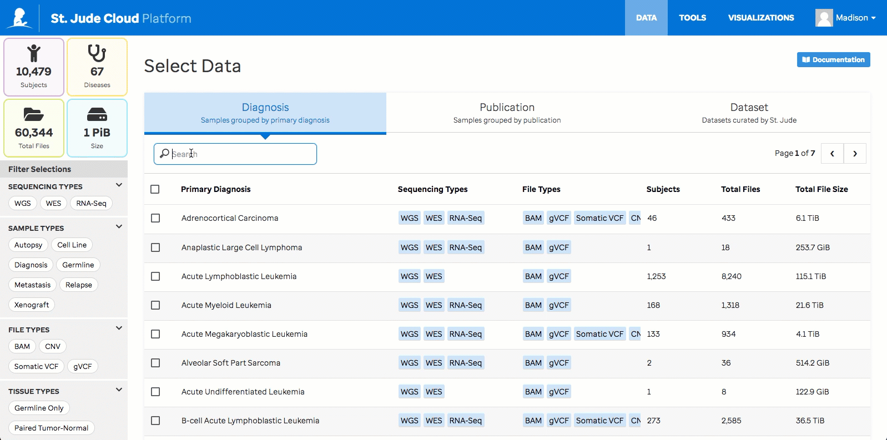
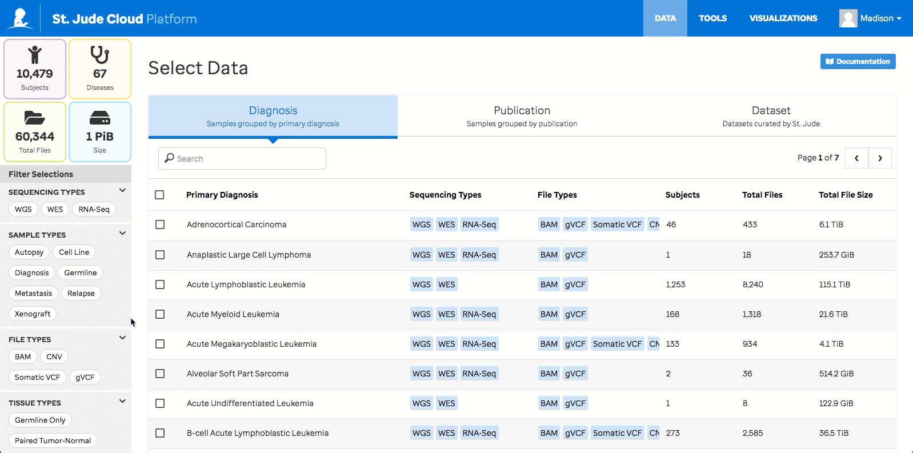
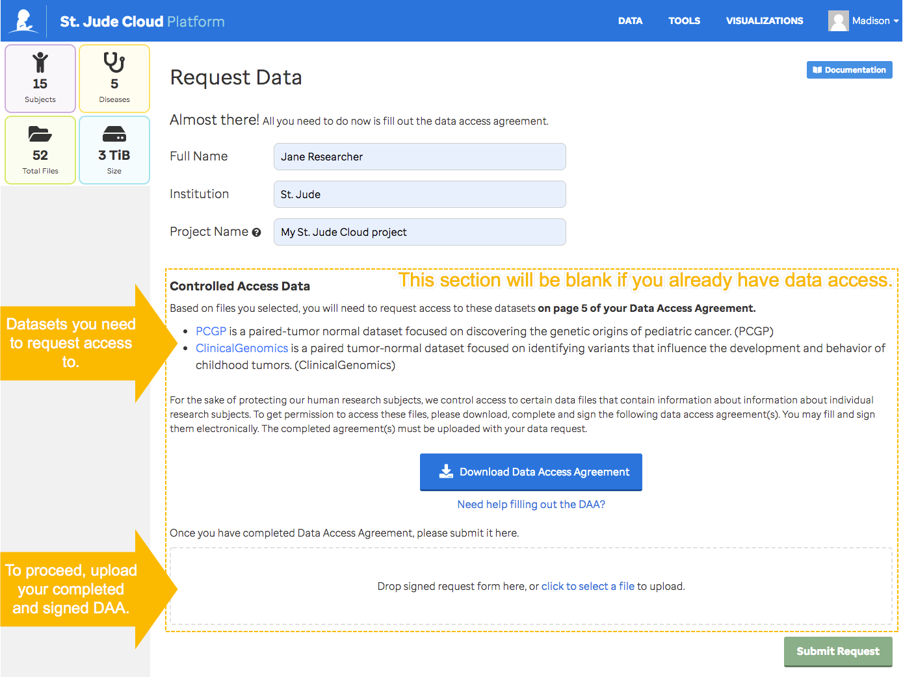
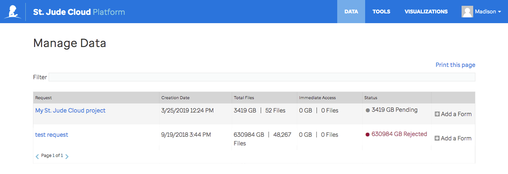

## Introduction

!!! note "Summary"

    1. Data in St. Jude Cloud is grouped into different [Data Access Units (DAUs)](../../guides/glossary/data-access-unit) which usually correspond to large-scale sequencing initiatives at St. Jude. 
    2. Individuals can [apply for access](../../guides/glossary/data-access-agreement) to DAUs on a case-by-case basis for a specific amount of time (usually 1 year).
    3. Access to data in a given DAU is assessed by the corresponding [Data Access Committee](../../guides/glossary/data-access-committee) who reviews a variety of factors to grant access.
    4. There are a number of terms of use and restrictions outlined in the [data access agreement](https://platform.stjude.cloud/access_form). Everyone who will be working with the data must understand and agree to these terms.

Creating a data request is the premier way to access raw St. Jude next 
generation sequencing data in the cloud. You can get a **free** copy of 
the data in a secure cloud environment powered by [Microsoft Azure](https://azure.microsoft.com/en-us/) and 
[DNAnexus](https://www.dnanexus.com/), or you can elect to download the data to your local computing 
environment.

!!! note
    If you would like to download the data to local storage, there are
    extra steps you'll need to follow such as [getting additional signatures](../../guides/forms/how-to-fill-out-DAA#data-download-permission)
    on your data access agreement. We recommend that you work with the data
    in the cloud if it's feasible; the data provided by St. Jude is free, the compute charges are reasonable, and working in the cloud helps to eliminate the long, error-prone downloading process. Porting your tools to be run in the cloud is easy, as well. We recommend you follow [this guide](../../guides/data/run-your-tools) to get started.

## Selecting Data

There are two ways to make your data selection. You can peruse our raw genomic data by diagnosis, publication, or dataset using our [Data Browser](https://platform.stjude.cloud/requests/diseases), a tabular view with a number of filtering options. Or you can select samples associated with specific diagnoses, gene expression, or gene mutations while exploring curated data from the donut and bubble charts on the [Pediatric Cancer portal (PeCan)](https://pecan.stjude.cloud/) homepage.

### Selecting Data in the Data Browser

Go to the Data Browser [here](https://platform.stjude.cloud/requests/diseases), or navigate there from the St. Jude Cloud home page by clicking Access Data and then Explore Data.

From the Data Browser, you can view samples grouped by Diagnosis, Publication, or [Dataset](../../guides/glossary/data-access-unit) by toggling the tabs above the table. Use the search bar to look for something specific. Search the publication tab by title or pubmed ID.

You can further refine your data selection by using the filters for sequencing type, sample type, file type, and tissue type on the left side bar. Filters of the same type apply using “OR” logic. Filters of different types apply using “AND” logic. Note that filtering is dynamic, so as you make selections the table will update to show all of the files we have that match your filters. Filters reset when you move from tab to tab.

The summary panel above the filters in the left side bar shows statistics about the data currently displayed in the table. As you can see in gifs above, this panel updates as you change what data is displayed by switching tabs, searching, filtering, or making selections.

### Selecting Data via PeCan

Go to the [PeCan homepage](https://pecan.stjude.cloud/). A guide to interpreting the donut and bubble chart visualizations on the homepage can be found [here](../../guides/portals/pecan).

Using these visualizations along with ProteinPaint, you can:

1. Add samples to your cart by diagnosis.

<video controls="controls" width="640" height="400">
    <source src="https://pecan.stjude.cloud/assets/video/pecan-cart-by-disease.mp4" type="video/mp4">
</video>

2. Add samples to your cart by gene mutation.

<video controls="controls" width="640" height="400">
    <source src="https://pecan.stjude.cloud/assets/video/pecan-cart-by-gene-mutation.mp4" type="video/mp4">
</video>

3. Add samples to your cart by gene expression.

<video controls="controls" width="640" height="400" class="anything">
    <source src="https://pecan.stjude.cloud/assets/video/pecan-cart-by-gene-expression.mp4" type="video/mp4">
</video>

Clicking *Submit to SJCloud* from the PeCan checkout window will land you back in the Data Browser with your checked out data selected.

## Requesting Data

Once you have made your selections, click the red *Request Data* button at the bottom of the table. 

!!! warning
    You must have created an account and be logged in to make a data request. If you have not yet created an account or you are not logged in, the red *Request Data* button will say *Log In*.

On the Request Data page fill out your name, institution, and project name. Give your data request a project name that makes sense to you as this will be the name of the DNAnexus project to which the data will be vended.

!!! note "Data Access Approval"
    If you are requesting access to a dataset you have not yet been approved for, 
    you will see a section called **Controlled Access Data**. Under this section, there is a bulleted list indicating the dataset(s) or [Data Access Unit(s)](../../guides/glossary/data-access-unit) you must request access to by submitting a form called the [Data Access Agreememnt (DAA)](../../guides/glossary/data-access-agreement). Please use this list to fill in the Datasets section of the DAA. For more information on filling out this form, see [Filling out the DAA](../../guides/forms/how-to-fill-out-DAA). **You must upload a DAA to continue.**

Finally, click the green button. If you already have access to the data you selected in the browser, the button will read *Get Data Now*. If you are submitting a DAA and requesting data access, the button will read *Submit Request*.

This will direct you to the [Manage Data](https://platform.stjude.cloud/requests/manage) page where you can see the status of the data request you just made as well the history of any of your previous data requests. 

If you already have access to the data that you requested, your data will be vended to you immediately. Otherwise, the status of your request will say *Pending* while your request is routed to the respective [Data Access Committee(s)](../../guides/glossary/data-access-committee) for evaluation. Request approval typically takes a week or two if your data access agreement is correctly and completely filled out. You will receive automated emails from notifications@stjude.cloud at the time that your request is recieved and once your request is approved.

!!! note 
    If you receive an email from us that your DAA is incomplete, you may edit your DAA and upload the revised copy using the 'Add a Form' button the on Manage Data page. 

### Viewing your Data

Once your request to access data is approved, the data will be vended to your DNAnexus account in a project with the project name that you entered on the Request Data page. You can follow the link in the email from notifications@stjude.cloud to view your DNAnexus project page.

 
