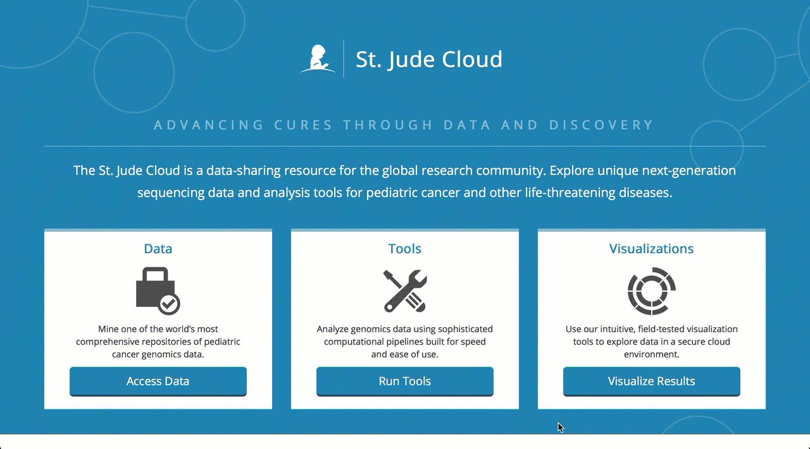
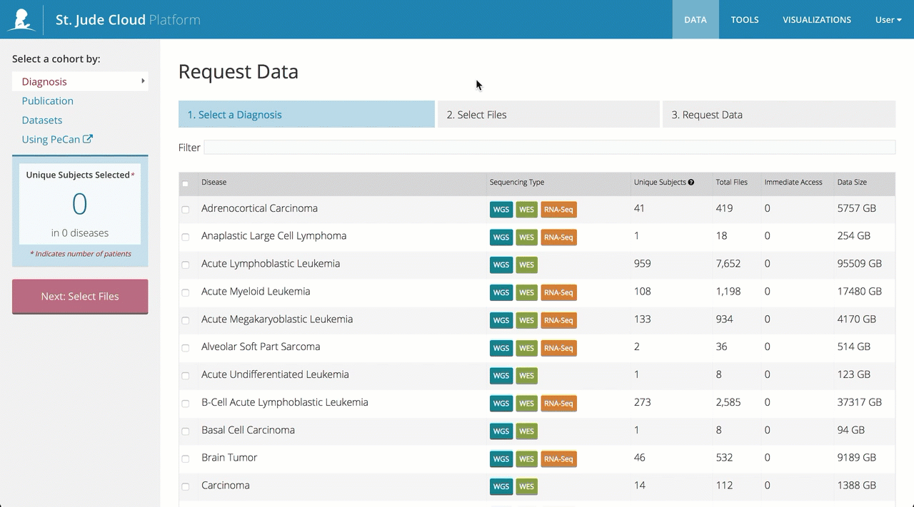

## Introduction

!!! note "Summary"

    1. Data in St. Jude Cloud is grouped into different data access units (DAUs) which usually correspond to large-scale sequencing initiatives at St. Jude. 
    2. Individuals can apply for access to DAUs on a case-by-case basis for a specific amount of time (usually 1 year).
    3. Access to data in a given DAU is assessed by the corresponding data access committee (DAC) who assess a variety of factors to grant access.
    4. There are a number of terms of use and restrictions outlined in the [data access agreement](https://platform.stjude.cloud/access_form). Everyone who will be working with the data must read and understand these terms.

Creating a data request is the premier way to access raw St. Jude next 
generation sequencing data in the cloud. You can get a **free** copy of 
the data in a secure cloud environment powered by Microsoft Azure and 
DNAnexus, or you can elect to download the data to your local computing 
environment.

!!! note
    If you would like to download the data to local storage, there are
    extra steps you'll need to follow such as getting additional signatures
    on your data access agreement. We recommend that you work with the data
    in the cloud if it's feasible; the data provided by St. Jude is free, the compute charges are reasonable, and working in the cloud helps to eliminate the long, error-prone downloading process. Porting your tools to be run in the cloud is easy, as well. We recommend you follow [this guide](../../guides/data/run-your-tools) to get started.

## Requesting Data

### Navigate to the Data Browser

Navigate to the data browser by clicking Access Data and Explore
Data. If you would like to view the requests you have already made, you
can do so under Manage Data.

### Select Your Data
Next, select the cohort you are interested in requesting. You can
browse our data by disease, publication, dataset, or
you can use Pecan, our Pediatric Cancer portal, to find samples
associated with specific genes, or mutations. 

### Select Your Files
Once you have selected the cohort you would like to study, you can chose what
type of files you would like to receive. This step is dynamic, and shows
you all of the file types we have available for the dataset you are
interested in.

### Submit Your Request

If you are requesting access to a dataset you have not already been approved for, 
you will see a section called Controlled Data. Under this section, there is a bulleted list
that indicates the Data Access Units you need to request access to through our data
access agreement. Please use this list to fill in the Datasets section of the Data Request
Form as shown in the figure below. For more information on filling out this guide,
see [Filling out the DAA](#filling-out-the-daa).

Now, you have successfully submitted your data request. Your request
will be sent to the respective data access committees for evaluation.
You should expect to hear from us within a week or two on average. 