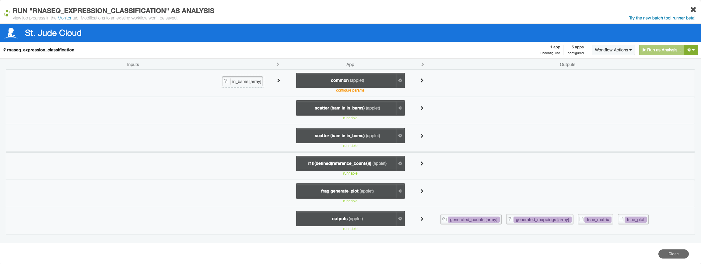
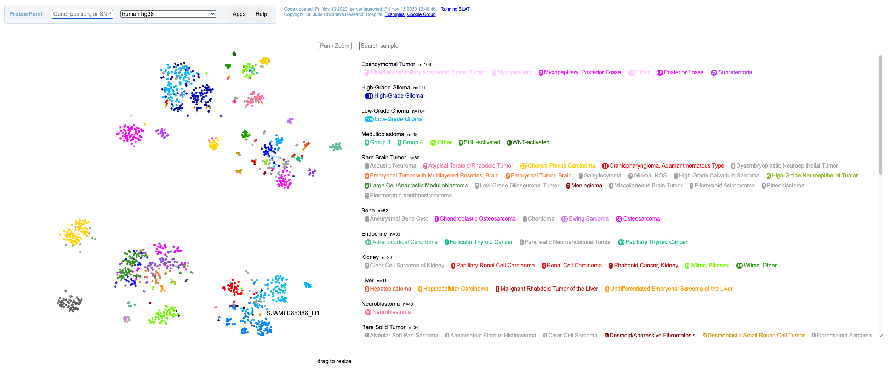

# RNA-Seq Expression Classification

## Overview

St. Jude Cloud provides functionality for generating RNA-Seq Expression Classification plots. This tool allows plotting of RNA-seq data by running through the St. Jude Cloud normalization [pipeline](https://stjudecloud.github.io/rfcs/0001-rnaseq-workflow-v2.0.html). The generated count data is then compared to a reference set of data from a cohort of St. Jude samples and a plot is produced.

## Requirements

* The RNA-Seq Expression Classification pipeline reference data uses sequencing data from fresh, frozen tissue samples. It has not been evaluated for use with sequencing data generated from formalin-fixed paraffin-embedded (FFPE) specimens.
* If running the count-based pipeline, alignment must be done against the [GRCh38_no_alt reference](ftp://ftp.ncbi.nlm.nih.gov/genomes/all/GCA/000/001/405/GCA_000001405.15_GRCh38/seqs_for_alignment_pipelines.ucsc_ids/GCA_000001405.15_GRCh38_no_alt_analysis_set.fna.gz). It should use parameters as specifed in our [RNA-seq workflow](https://stjudecloud.github.io/rfcs/0001-rnaseq-workflow-v2.0.0.html) to minimize any discrepancies caused by differing alignment specification.
* If running the count-based pipeline, feature counts should be generated with htseq-count as described in our [RNA-seq workflow](https://stjudecloud.github.io/rfcs/0001-rnaseq-workflow-v2.0.0.html). This pipeline uses [Gencode v31](ftp://ftp.ebi.ac.uk/pub/databases/gencode/Gencode_human/release_31/gencode.v31.annotation.gtf.gz) annotations.

## Inputs

The input can be either of the two entries below, based on whether you want to start
with a counts file or a BAM file.

| Name | Description | Example |
|--|--|--|
| BAM file | Aligned reads file from human RNA-Seq | Sample.bam |
| Counts file | htseq-count output feature counts file from human RNA-Seq | Sample.counts.txt |

!!! caution
    If you provide counts data to the counts-based pipeline, 
    it **must** be aligned to `GRCh38_no_alt`.
    Running a sample aligned to any other reference genome is not supported. Maybe more
    importantly, we do not check the genome build of the BAM, so errors in computation
    or the results can occur. If your sample is *not* aligned to this genome build, we
    recommend submitting the sample to the realignment-based workflow.

## Outputs

The RNA-Seq Expression Classification pipeline produces the following outputs:

| Name | Description | Pipeline Version |
|--|--|--|
| Interactive expression plot (.html) | Visualization of RNA-Seq data | all |
| Aligned BAM (.bam) | BAM file produced by our RNA-Seq pipeline for the input samples. | Realignment |
| Feature read counts (.txt) | Read counts for the Gencode features. | Realignment |

## Workflow Steps

1. The aligned BAM is converted to FastQ and is aligned to `GRCh38_no_alt`
   using [standard STAR mapping](https://stjudecloud.github.io/rfcs/0001-rnaseq-workflow-v2.0.0.html).
   * Only for realignment workflow
2. A feature count (.count.txt) file is produced for comparison to
   St. Jude Cloud reference data.
   * Only for realignment workflow
3. A visualization for genomic features is produced.

### Mapping

We use the [STAR aligner](https://www.ncbi.nlm.nih.gov/pmc/articles/PMC3530905/)
to rapidly map reads to the GRCh38 human reference genome.

### Feature Counts

We use [htseq-count](https://htseq.readthedocs.io/en/latest/count.html)
to produce genomic feature counts.

### Visualization

A t-Distributed Stochastic Neighbor Embedding (t-SNE) visualization is produced using [Rtsne](https://github.com/jkrijthe/Rtsne). You can find the t-SNE paper [here](http://www.jmlr.org/papers/volume9/vandermaaten08a/vandermaaten08a.pdf).

## Getting Started

!!! caution
    If you provide counts data to the counts-based pipeline,
    it **must** be aligned to `GRCh38_no_alt`.
    Running a sample aligned to any other reference genome is not supported. Maybe more
    importantly, we do not check the genome build of the sample, so errors in computation
    or the results can occur. If your sample is *not* aligned to this genome build, we
    recommend submitting the sample to the realignment-based workflow.

We provide two versions of the RNA-Seq Expression Classification tool depending on desired input. The full workflow allows a user to upload a sample in BAM format. That sample will then be converted to `FastQ` format, aligned with `STAR` two-pass alignment, and feature counts generated with `htseq-count`

To get started, you need to navigate to the [RNA-Seq Expression Classification tool page](https://platform.stjude.cloud/tools/rnaseq-expression-classification). You'll need to click the "Start" button in the left hand pane. This creates a cloud workspace in DNAnexus with the same name as the tool. After this, you will be able to upload your input files to that workspace.

## Uploading data

The RNA-Seq Expression Classification pipeline takes either a htseq-count count file or a GRCh38_no_alt aligned BAM from human RNA-Seq. You can upload your input file(s) using the data transfer application or by uploading them through the command line. Both of the guides linked here will contain more details on how to upload data using that method, so we defer to those guides here.

## Running the tool

Once you've uploaded data to your cloud workspace, click "Launch Tool" on the tool's landing page. A dropdown will present the different presets for running the workflow. Here, you can select whether you wish to start with a counts file or a BAM file.

## Obtaining reference data

Reference feature count data can be downloaded through the [Genomics Platform Data Browser](https://platform.stjude.cloud/data/publications?publication_accession=SJC-PB-1020). These must then be provided to the workflow through the `reference_counts` parameter. By default, all reference files will be used by the app, but this can be restricted to one of the three tumor types [Blood, Brain, Solid] through the app settings.

## Preparing input data

To run an input sample, certain properties need to be set on the file.

| Property Name | Values |
|--|--|
| sample_name | should match filename up to first period (".")|
| library_type | PolyA or Total |
| read_length | integer, in bp |
| strandedness | Stranded-Forward, Stranded-Reverse, Unstranded |
| pairing | Paired-end or Single-end |

## Hooking up inputs

You will need to select reference counts files from your project. These can be specified in the reference counts data input.

Next, you'll need to hook up either the counts file or the BAM file you uploaded in the upload data section. In this example, we are using the realignment version of the pipeline, so you can hook up the inputs by clicking on the in_bams slot and selecting the respective files. If you are using the counts-based workflow, the process is similar.

Additionally, a parameter selecting the tissue type to compare against can be selected. The available options are "Blood Cancers", "Brain Tumors", and "Solid Tumors". Based on the selection, a reference collection of tumors of that type will be selected from St. Jude Cloud data and the input samples will be compared against this reference collection.

## Starting the workflow

Once your input files are hooked up, you should be able to start the workflow by clicking the "Run as Analysis..." button in the top right hand corner of the workflow dialog.

## Monitoring run progress
Once you have started one or more RNA-Seq Expression Classification runs, you can safely close your browser and come back later to check the status of the jobs. To do this, navigate to the tool's landing page. Next, click "View Results" then select the "View Running Jobs" option. You will be redirected to the job monitoring page. Each job you kicked off gets one row in this table.

You can click the "+" on any of the runs to check the status of individual steps of the RNA-Seq Expression Classification pipeline. Other information, such as time, cost of individual steps in the pipeline, and even viewing the job logs can accessed by clicking around the sub-items.

## Interpreting Results

Once the resulting analysis job completes, an HTML plot of the results should be available. The plot is generated with the [Plotly R library](https://plot.ly/r/). The plot can be zoomed arbitrarily and group labels can be turned on/off for manual inspection. User input samples will be displayed in black marks with a label on the graph as well as an entry in the legend.

## Cost Estimation

| Workflow Name | Per sample cost | Outliers |
|--|--|--|
| Realignment workflow | $3-$10 | $25 |
| Feature read counts workflow | $0.30-0.40 | |

## Batch effect corrections

When comparing numerous samples such as those included in this analysis, it is important to consider 
the variation in data created by obtaining from various sources and across time. Therefore the t-SNE
visualization incorporates some batch effect corrections for the reference data. Currently we correct 
for batch effect based on strandedness of the RNA-Seq sample, library type, and read length protocol.

## Known issues

!!! caution "Fresh Frozen Tissue Only
     The RNA-Seq Expression Classification pipeline reference data uses sequencing data from fresh, frozen
     tissue samples. It has not been evaluated for use with sequencing data
     generated from formalin-fixed paraffin-embedded (FFPE) specimens.

!!! caution "GRCh38 required"
    If running the count-based RNA-Seq Expression Classification pipeline, alignment must be
    done against the [GRCh38_no_alt reference](ftp://ftp.ncbi.nlm.nih.gov/genomes/all/GCA/000/001/405/GCA_000001405.15_GRCh38/seqs_for_alignment_pipelines.ucsc_ids/GCA_000001405.15_GRCh38_no_alt_analysis_set.fna.gz). 
    It should use parameters as specifed in our [RNA-seq workflow](https://stjudecloud.github.io/rfcs/0001-rnaseq-workflow-v2.0.0.html) to minimize any discrepancies caused by differing alignment specification.

!!! caution "Standardized feature counts must be provided"
    If running the count-based RNA-Seq Expression Classification pipeline, feature counts should be generated
    with htseq-count as described in our [RNA-seq workflow](https://stjudecloud.github.io/rfcs/0001-rnaseq-workflow-v2.0.0.html). 
    This pipeline uses [Gencode v31](ftp://ftp.ebi.ac.uk/pub/databases/gencode/Gencode_human/release_31/gencode.v31.annotation.gtf.gz) annotations.

## Frequently asked questions

If you have any questions not covered here, feel free to reach out on [our contact form](https://hospital.stjude.org/apps/forms/fb/st-jude-cloud-contact/).

## Submit batch jobs on the command line

See [How can I run an analysis workflow on multiple sample files at the same time?](https://www.stjude.cloud/docs/faq/#how-can-i-run-an-analysis-workflow-on-multiple-sample-files-at-the-same-time)
