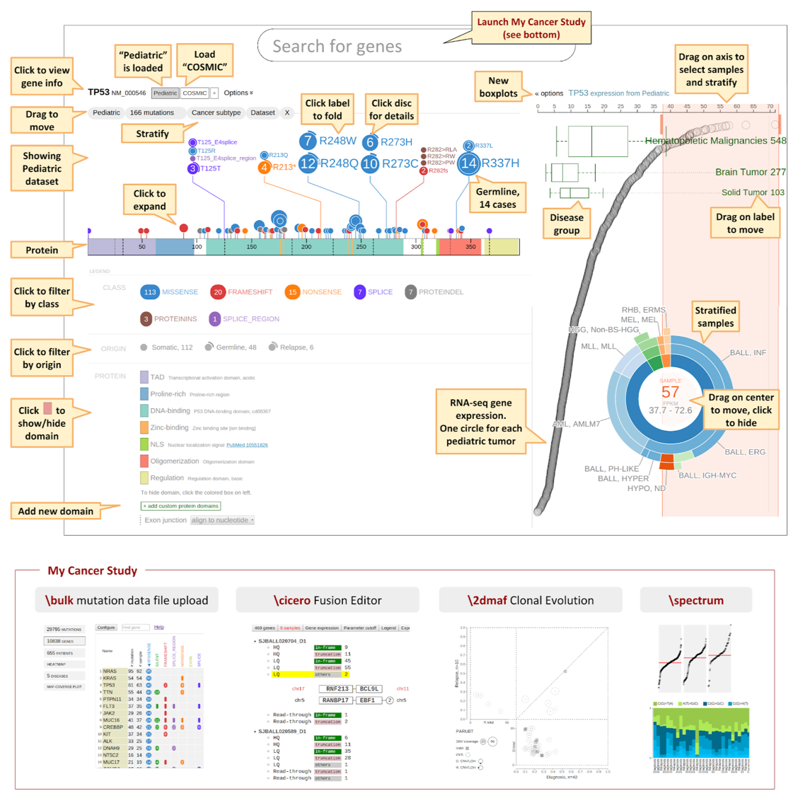

# PeCan Data Portal 
PeCan provides interactive visualizations of pediatric cancer mutations across various projects at St. Jude Children's Research Hospital and its collaborating institutions.

## Homepage 
The [PeCan homepage](https://pecan.stjude.cloud/home) contains two main visualizations that work with each other to give a high level overview of the data being presented (SJ Cloud's [PCGP](/docs/guides/glossary/data-access-unit#pediatric-cancer-genome-project-(pcgp)) dataset along with curated datasets from other instiutions such as [TARGET](https://ocg.cancer.gov/programs/target), [dkfz](https://www.dkfz.de/en/index.html), and others).

### Donut Chart
The donut chart (shown below) gives an at-a-glance disease distribution and disease heiarchy. 

You can hover over the various donut slices to glance at the number (and %) of samples being represented by that disease. The diseases are categorized in two three main root categories: 1) HM -Hematopoietic Malignancies, 2) BT -Brain Tumor, 3) ST -Solid Tumor.

[Click here](../data/metadata#short-disease-code-mapping) for a full mapping of disease codes.

### Bubble Chart
Any slice (at any level) of the donut chart can be clicked on to select it, and reveal a bubble chart of related genes. 

Note that the dataset bar (shown below) on top of the bubble chart visualizes the distribution of selected data across the datsets used in this visualization. It will update dynamically as you interact with the donut chart and make different selctions.

An example of the bubble chart is shown below.

You can see the selected disease shown at the top (1). The bubbles represent the most prevalent genes in the selected disease sample set. The size of the bubble corresponds to the number of mutations in the set with that gene.

For some disease sets (like the one shown above), we have identified the most important disease pathway for the gene and have categorized them as such. This information is represented here via the use of colors. The legend at the bottom allows you to view the pathway information being shown (including the number of genes that are attached to each pathway).

Hovering over a pathway in the legend will highlight all matching genes. Clicking a gene will open it's ProteinPaint.

## ProteinPaint

[ProteinPaint](https://pecan.stjude.cloud/proteinpaint) is a web application for simultaneously visualizing genetic lesions (including sequence mutations and gene fusions) and RNA expression in pediatric cancers. You can find the ProteinPaint [paper here](https://www.nature.com/articles/ng.3466). 

### Overview
The image below shows an example ProteinPaint of the gene [TP53](https://pecan.stjude.cloud/proteinpaint/TP53) annotated with descriptions of the many interactive elements of a ProteinPaint visualization. As you can see, there is a lot to explore.

!!! note
    A detailed tutorial for ProteinPaint can be found [here](https://docs.google.com/document/d/1JWKq3ScW62GISFGuJvAajXchcRenZ3HAvpaxILeGaw0/edit). Please excuse the different location and formatting as we work to incorporate this into our main documentation pages. 

### Glossary of Classes 

The list below summarizes all classes of mutations used by ProteinPaint.

| Mutation Class | Description                                |
| ------------------ | --------------------------------------------------------- |
| MISSENSE	| a substitution variant in the coding region resulting in altered protein coding | 
| FRAMESHIFT	| an insertion or deletion variant that alters the protein coding frame| 
| NONSENSE	| a variant altering protein coding to produce a premature stopgain or stoploss.|
| PROTEINDEL	| a deletion resulting in a loss of one or more codons from the product, but not altering the protein coding frame |
|PROTEININS	| an insertion introducing one or more codons into the product, but not altering the protein coding frame|
 | SPLICE	| a variant near an exon edge that may affect splicing functionality |
| SILENT	| a substitution variant in the coding region that does not alter protein coding |
| SPLICE_REGION	| a variant in an intron within 10 nt of an exon boundary |
| UTR_5	| a variant in the 5' untranslated region |
| UTR_3	| a variant in the 3' untranslated region |
| EXON	| a variant in the exon of a non-coding RNA |
| INTRON	| an intronic variant |

### Glossary of Origins

The list below summarizes all origins of mutations used by ProteinPaint.

| Mutation Origin | Description                                |
| ------------------ | --------------------------------------------------------- |
| Germline	|a variant found in a normal sample of a cancer patient. |
| Somatic	| a variant found only in a tumor sample. |
| Relapse	| a variant that arose in recurrence tumor. |

## Studies
[Here](https://pecan.stjude.cloud/studies) you can explore recently published, interactive visualizations that have been created in ProteinPaint.

## PeCan Pie
PeCan Pie documentation can be found [here](/docs/guides/tools/pecan-pie).