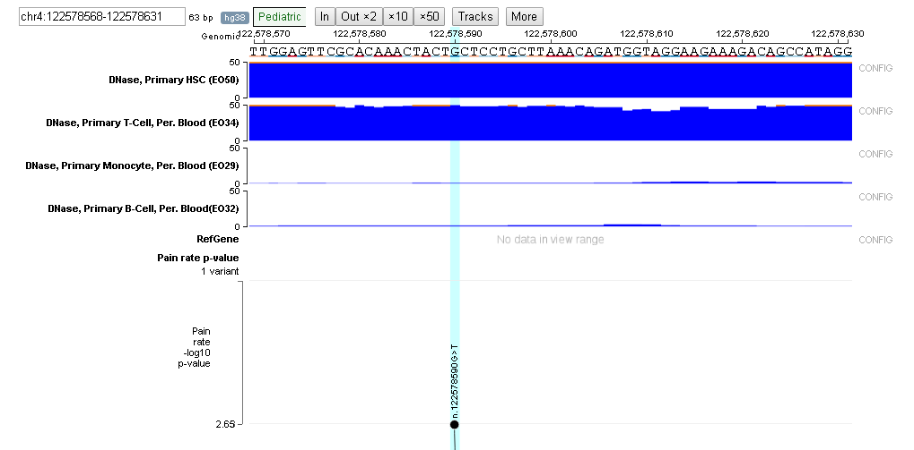
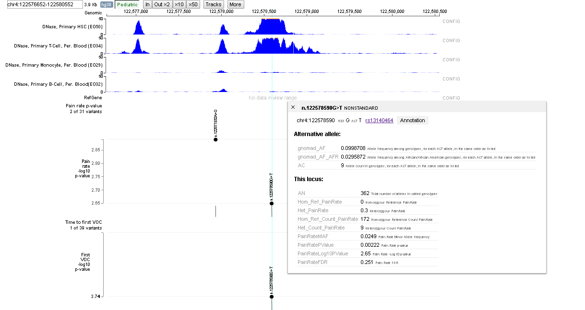

# Index
### [Glossary](#Glossary)
### [Visualizations](#Visualizations)
#### [Genome Browser](#genome-browser)
### [Tutorial](#tutorial)

# Glossary

#### HbF (Fetal hemoglobin)
Fetal hemoglobin contains two subunit of gamma-globin and two units of alpha-globin, while adult hemoglobin contains two subuints of beta-globin and two units of alpha-globin.  
#### HPFH (Heriditary persistance of fetal hemoglobin)
Inividuals with HPFH have elevated levels of fetal hemoglobin. These elevated levels reduce or eliminate many of the symptoms of Sickle Cell Disease
#### PCA
A [method](https://www.jmp.com/support/help/14/principal-components.shtml) for reducing high dimensional data into low-dimensional representations.
#### SC
And individual with one copy of the sickle cell allele [rs334](https://www.ncbi.nlm.nih.gov/snp/rs334) and one copy of [hemoglobin C](https://medlineplus.gov/ency/article/000572.htm)
#### S&beta;+
An individual with [beta-thalassemia](https://ghr.nlm.nih.gov/condition/beta-thalassemia) who has one copy of the sickle cell allele [rs334](https://www.ncbi.nlm.nih.gov/snp/rs334) and one copy of a beta-globin gene that has reduced expression.
#### S&beta;0
An individual with [beta-thalassemia](https://ghr.nlm.nih.gov/condition/beta-thalassemia) who has one copy of the sickle cell allele [rs334](https://www.ncbi.nlm.nih.gov/snp/rs334) and one copy of a beta-globin gene that is not expressed or is deleted.
#### SS 
An individual with [sickle cell disease](https://ghr.nlm.nih.gov/condition/sickle-cell-disease) who is homozygous for the sickle cell allele [rs334](https://www.ncbi.nlm.nih.gov/snp/rs334).
#### SCCRIP
The [Sickle Cell Research and Intervention Program](https://www.stjude.org/research/clinical-trials/sccrip-hematological-disorder.html)
  

# Visualizations
## Genome Browser

Upon launching the browser, you will see an image similar to the one shown here.

### Browser overview

A description of the elements of the browser are as follows:

|#   |      Description      |  
|----------|-------------|
| 1| Navigation tools and track selector. ([See Navigation Buttons section](#navigation-buttons))  | 
|2|    DNase hypersensitivity tracks.  By default, four epigenetic tracks are shown.  These are DNAse hypersensitivity tracks for Hematopoeitic stem cells (HSC), T Cells, Monocytes, and B Cells.  Additional tracks can be viewed by selecting the ‘Tracks’ button (See Adding/Removing Tracks section below)  |  
|3 | RefSeq genes.  Gene models from the RefSeq database are displayed in this tracks. | 
|4 |-log10 of the p-value of the association of each variants with pain rate in individuals with Sickle Cell Disease.  The analysis has only been performed around the  KIAA1109/Tenr/IL2/IL21 region.   Each dot on the track represents a genomic variant (Single Nucleotide Variant (SNV) or small insertion/deletion (INDEL)).  The Y-axis for the track represents the -log10 of the p-value.  The higher the value, the more stastically significant the association between the variant and pain rate is.  Clicking on a variant will open op a window that gives further details about the variant.  (See Figure 3). | 
|5 | -log10 of the p-value of the association of each variants with age of first vaso-occlusive crisis in individuals with Sickle Cell Disease.  See (4) above for more information on this type of trac. | 
|6| Filters: Filters allow variants within tracks to be filtered by numerous citeria.  [See Filter description](#Filters)|

### Navigation buttons

|#   |      Description      |  
|----------|-------------|
| a|Location/Locus entry field.  One can enter genomic coordinates in the form of chromosome:start-end (for example chr1:12345-9876), or a gene name or a SNP rs ID. | 
|b|   Browser zoom in and out |  
|c | Tracks: Add or hide tracks (See section below on adding/hiding tracks( | 
|d |More:  Save svg image of browser, get DNA sequence or highlight regions of the browser. | 

### Filters

|#   |      Description      |  
|----------|-------------|
| a| Filters for pain rate p-value track | 
|b|  Filters for age of first vaso-occlusive crisis (VOC) p-value |  
|c | The highlighted filter shows which value is  used for the Y-axis on the browser track.  The vale can be changed. | 
|d | A highligthed vale within a filter shows which filter value is set.  The number next to the filter represents the number of individuals that meet the filter criteria.| 

By default, both track on the default page have been filtered to 

## Tutorial
### Finding a variant of interest
A user can navigate to a gene or to a variant ID.
Enter in the variant ID rs13140464 into the search text field at the top of the browser. (See below)

Pressing enter will center the browser of the selected variant.  (see below)

### Zooming in and out
One can use the buttons next to the search field to zoom in and out along the genome.  Press the x50 button to zoom out 50 fold

This will show a larger region of the chromosome.

One can now see three DNase peaks (1) around the rs13140464 variant(2).  In addition there is another variant (3) seen near one of the DNase peaks.

### Obtaining additional variant information
Left clicking a variant (see red circle below), will cause a new window to pop up in the browser that will contain additional information about the variant.

