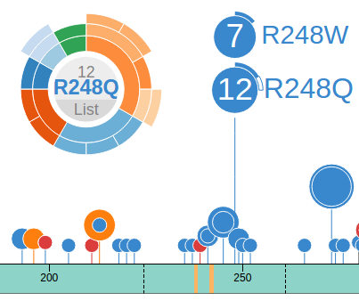
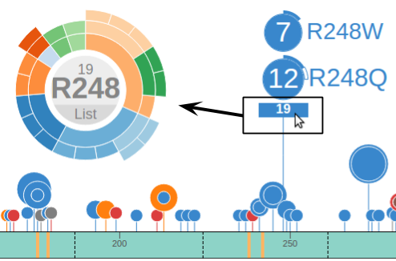
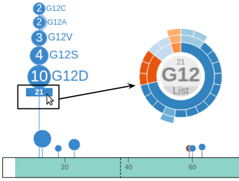
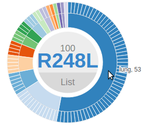
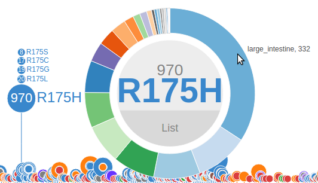
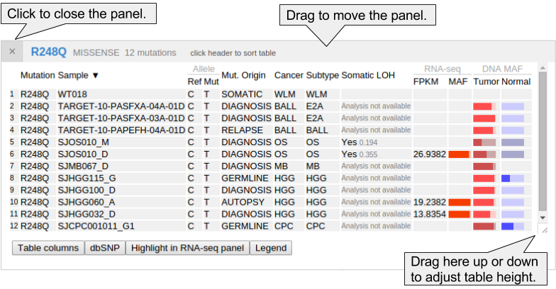
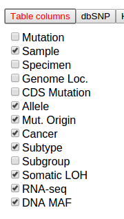
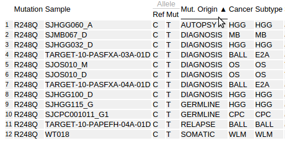
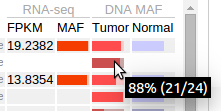
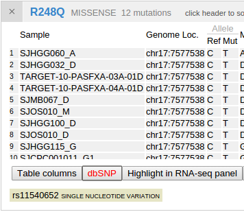

In the Pediatric data set, clicking on a disc will bring up a sunburst
chart showing the cancer type and subtype information for the set of
samples affected by this mutation. The sunburst chart is labeled by
amino acid change in the center and can be moved by clicking and
dragging on this label:

In a sunburst chart, the inner layer represents cancer types. The
outmost layer represents each individual sample. When there is cancer
subtype information available for the sample, an intermediate layer will
appear. Hovering cursor on any layer will display the name:

Mousing over the bottom of the R248Q disc will show a box with number
16, representing all 16 mutations at the position R248 (11 from R248Q, 5
from R248W). Clicking this box will bring up a new chart representing
these 16 mutations. Notice the label at the center now reads "R248",
indicating it now represents all amino acid changes at R248:

This feature is handy for exploring cases like the *KRAS* mutations at
G12, a hotspot with multiple mutated alleles. A single click will show
the cancer type composition for all different types of G12 mutations:

For COSMIC, clicking on a disc will also generate a sunburst chart but
consisting of only two layers: the inner layer representing the source
tissue type of the cancer, and the outer layer representing samples:

As an optimization to improve performance, when the number of mutations
is greater than 400, the sunburst chart will not show individual samples
at the outmost ring:

To dismiss the chart, click on the center of the ring around the
mutation name.

Click the "List" button inside the chart to show a mutation table, as
described below.

### **Using the mutation table**

The mutation table is a powerful and versatile tool for examining
details about samples and mutations. The following table shows details
for the pediatric cases of TP53 p.R248Q:

Additional columns that are not shown by default may be added by
clicking the button "Table columns", which shows a list of all available
columns. Toggle the checkboxes to add/remove columns to the mutation
table. The following shows the column listing for the Pediatric dataset:

Clicking on the header of any column in the table will sort the table
based on the values in that column. Sorted columns will show a black
up/down arrow in their header. Clicking the header again will reverse
the sorting order:

In the Pediatric mutation table, the cancer types are shown in
abbreviated forms. Hover the cursor over the abbreviations to display
their full names:

In Pediatric data set, mutant allele fraction (MAF) information is
available for the DNA of tumor and normal genomes, and for tumor RNA-Seq
of selected samples. This information is displayed in graphical forms of
"percentage bars". Hover over a bar to see the fraction value and read
counts:

If the total read count is below the cutoff of 30, the bar will appear
darkened:

MAF value graphical display is also explained in the table legend,
brought up by clicking the "Legend" button:

Loss of heterozygosity (LOH) information will be shown in the mutation
table for part of the Pediatric samples, which is also explained in the
legend above.

dbSNPs that are overlapping with mutations will be identified and shown
along with the mutation table. Click the second button "dbSNP" in the
bottom to show any such hits. Click on the displayed SNP to view its
record in the dbSNP database:

The button labeled "highlight in RNA-Seq panel" is explained in section
\[put link here\].

## Zooming in to browse mutations at nucleotide level

!!! todo
    We are still working on importing this content to the official St. Jude Cloud guide. Please be patient with us! If you have any questions, please [contact us](mailto:support@stjude.cloud). 
    
    Original Link: https://plus.google.com/u/0/+XinZhou_s/posts/5Ji9ZkecaDD
