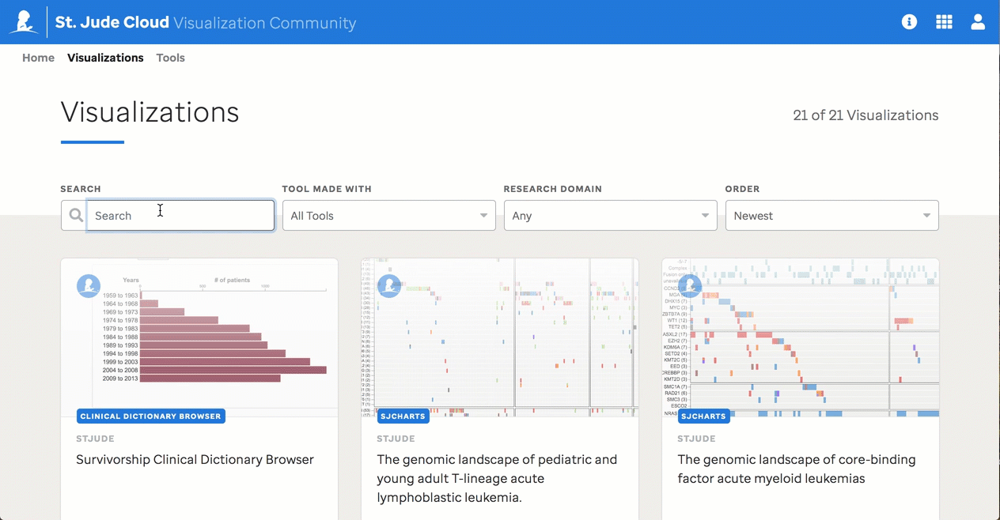

# Visualization Community

In St. Jude Cloud's [Visualization Community app](https://viz.stjude.cloud/), we provide genomic and phenomic data in cloud-based, dynamic visualizations generated by combining world class visualization software with high quality next-generation sequencing datasets, both generated and developed at St. Jude Children's Research Hospital. We aim to share these visualizations to encourage discovery amongst researchers; accessing raw data and having to start at the beginning isn't always most efficient. 

You can search interactive visualizations by Name, [Tool](https://viz.stjude.cloud/tools), [Research Domain](../../ecosystem.md), or chronological order.

## Visualization Tools 
* [ProteinPaint](https://viz.stjude.cloud/tools/proteinpaint/) is the flagship protein-based visualization tool created at St. Jude. You can use it to examine the domains of genes, known isoforms of a given gene, hotspot mutations for single nucleotide variations (SNVs), insertions and deletions (Indels), and structual variations (SVs) in both pediatric and adult cancers, and RNA-Seq expression of a given protein in different tumour types. [See the documentation here.](proteinpaint.md) 
* [GenomePaint](https://viz.stjude.cloud/tools/genomepaint/) visualizes somatic coding and noncoding alterations from ~3,800 pediatric trumors, along with multi-omics information to reveal oncogene activation by noncoding alterations, enhancer hijacking, aberrant splicing, mutual-exclusivity, mutation signature, and perform Kaplan-Meier analysis. It can be used to visualize your own data with easy customization and embedding on your own page. [See the documentation here.](genomepaint.md) 
* [SJCharts](https://viz.stjude.cloud/tools/genomepaint/) is a collection of plotting libraries useful in creating individual or summary level views of somatic and germline variation. It includes facilities for generating dynamic heatmaps variation in a cohort, Circos-like plot to summarize individual or cohort-level data (such as the one shown here), ribbon plots to visualize gene-pathway-diagnosis relationships, and much more. (Documentation coming soon.)